# Database Schema Analysis - CloudDeploy

## 1. Table Documentation

### User Management Tables

#### users
| Column Name | Data Type | Constraints | Description |
|-------------|------------|--------------|-------------|
| id | text | Primary Key, Default: nanoid() | Unique user identifier |
| firstName | text | Not Null, Default: "" | User's first name |
| lastName | text | Not Null, Default: "" | User's last name |
| isRegistered | boolean | Not Null, Default: false | User registration status |
| expirationDate | text | Not Null, Default: current timestamp | Account expiration date |
| createdAt | text | Not Null, Default: current timestamp | Account creation timestamp |
| created_at | timestamp | Default: now() | PostgreSQL timestamp |
| twoFactorEnabled | boolean | | Two-factor authentication status |
| email | text | Not Null, Unique | User's email address |
| emailVerified | boolean | Not Null | Email verification status |
| image | text | | User profile image URL |
| banned | boolean | | User ban status |
| banReason | text | | Reason for ban |
| banExpires | timestamp | | Ban expiration date |
| updated_at | timestamp | Not Null | Last update timestamp |
| role | text | Not Null, Default: "user" | User role (admin/user) |
| enablePaidFeatures | boolean | Not Null, Default: false | Paid features enabled |
| allowImpersonation | boolean | Not Null, Default: false | Impersonation permission |
| enableEnterpriseFeatures | boolean | Not Null, Default: false | Enterprise features enabled |
| licenseKey | text | | Enterprise license key |
| isValidEnterpriseLicense | boolean | Not Null, Default: false | License validation status |
| stripeCustomerId | text | | Stripe customer ID |
| stripeSubscriptionId | text | | Stripe subscription ID |
| serversQuantity | integer | Not Null, Default: 0 | Number of servers allowed |
| trustedOrigins | text[] | | Array of trusted origins |

#### organization
| Column Name | Data Type | Constraints | Description |
|-------------|------------|--------------|-------------|
| id | text | Primary Key, Default: nanoid() | Unique organization identifier |
| name | text | Not Null | Organization name |
| slug | text | Unique | URL-friendly organization name |
| logo | text | | Organization logo URL |
| created_at | timestamp | Not Null | Creation timestamp |
| metadata | text | | Additional metadata |
| ownerId | text | Not Null, Foreign Key → user.id | Organization owner |

#### member
| Column Name | Data Type | Constraints | Description |
|-------------|------------|--------------|-------------|
| id | text | Primary Key, Default: nanoid() | Unique member identifier |
| organizationId | text | Not Null, Foreign Key → organization.id | Organization reference |
| userId | text | Not Null, Foreign Key → user.id | User reference |
| role | text | Not Null | Member role (owner/member/admin) |
| created_at | timestamp | Not Null | Join timestamp |
| teamId | text | | Team identifier |
| is_default | boolean | Not Null, Default: false | Default organization flag |
| canCreateProjects | boolean | Not Null, Default: false | Project creation permission |
| canAccessToSSHKeys | boolean | Not Null, Default: false | SSH keys access permission |
| canCreateServices | boolean | Not Null, Default: false | Service creation permission |
| canDeleteProjects | boolean | Not Null, Default: false | Project deletion permission |
| canDeleteServices | boolean | Not Null, Default: false | Service deletion permission |
| canAccessToDocker | boolean | Not Null, Default: false | Docker access permission |
| canAccessToAPI | boolean | Not Null, Default: false | API access permission |
| canAccessToGitProviders | boolean | Not Null, Default: false | Git providers access permission |
| canAccessToTraefikFiles | boolean | Not Null, Default: false | Traefik files access permission |
| canDeleteEnvironments | boolean | Not Null, Default: false | Environment deletion permission |
| canCreateEnvironments | boolean | Not Null, Default: false | Environment creation permission |
| accesedProjects | text[] | Not Null, Default: ARRAY[] | Accessed projects array |
| accessedEnvironments | text[] | Not Null, Default: ARRAY[] | Accessed environments array |
| accesedServices | text[] | Not Null, Default: ARRAY[] | Accessed services array |

### Project & Environment Tables

#### projects
| Column Name | Data Type | Constraints | Description |
|-------------|------------|--------------|-------------|
| projectId | text | Primary Key, Default: nanoid() | Unique project identifier |
| name | text | Not Null | Project name |
| description | text | | Project description |
| createdAt | text | Not Null, Default: current timestamp | Creation timestamp |
| organizationId | text | Not Null, Foreign Key → organization.id | Organization reference |
| env | text | Not Null, Default: "" | Environment variables |

#### environments
| Column Name | Data Type | Constraints | Description |
|-------------|------------|--------------|-------------|
| environmentId | text | Primary Key, Default: nanoid() | Unique environment identifier |
| name | text | Not Null | Environment name |
| description | text | | Environment description |
| createdAt | text | Not Null, Default: current timestamp | Creation timestamp |
| env | text | Not Null, Default: "" | Environment variables |
| projectId | text | Not Null, Foreign Key → projects.projectId | Project reference |
| isDefault | boolean | Not Null, Default: false | Default environment flag |

### Application & Service Tables

#### applications
| Column Name | Data Type | Constraints | Description |
|-------------|------------|--------------|-------------|
| applicationId | text | Primary Key, Default: nanoid() | Unique application identifier |
| name | text | Not Null | Application display name |
| appName | text | Not Null, Unique, Default: generated | System-generated unique name |
| description | text | | Application description |
| env | text | | Environment variables |
| previewEnv | text | | Preview environment variables |
| watchPaths | text[] | | File paths to watch |
| previewBuildArgs | text | | Preview build arguments |
| previewBuildSecrets | text | | Preview build secrets |
| previewLabels | text[] | | Preview deployment labels |
| previewWildcard | text | | Preview wildcard domain |
| previewPort | integer | Default: 3000 | Preview port |
| previewHttps | boolean | Not Null, Default: false | Preview HTTPS enabled |
| previewPath | text | Default: "/" | Preview path |
| previewCertificateType | enum | Not Null, Default: "none" | Preview certificate type |
| previewCustomCertResolver | text | | Custom certificate resolver |
| previewLimit | integer | Default: 3 | Preview deployment limit |
| isPreviewDeploymentsActive | boolean | Default: false | Preview deployments active |
| sourceType | enum | Not Null | Source type (docker/git/github/etc) |
| buildType | enum | Not Null | Build type (dockerfile/heroku/etc) |
| serverId | text | Foreign Key → server.serverId | Primary server reference |
| buildServerId | text | Foreign Key → server.serverId | Build server reference |
| environmentId | text | Foreign Key → environments.environmentId | Environment reference |
| createdAt | text | Not Null, Default: current timestamp | Creation timestamp |

#### deployments
| Column Name | Data Type | Constraints | Description |
|-------------|------------|--------------|-------------|
| deploymentId | text | Primary Key, Default: nanoid() | Unique deployment identifier |
| title | text | Not Null | Deployment title |
| description | text | | Deployment description |
| status | enum | Default: "running" | Deployment status |
| logPath | text | Not Null | Log file path |
| pid | text | | Process ID |
| applicationId | text | Foreign Key → applications.applicationId | Application reference |
| composeId | text | Foreign Key → compose.composeId | Compose reference |
| serverId | text | Foreign Key → server.serverId | Server reference |
| isPreviewDeployment | boolean | Default: false | Preview deployment flag |
| previewDeploymentId | text | Foreign Key → previewDeployments.previewDeploymentId | Preview deployment reference |
| createdAt | text | Not Null, Default: current timestamp | Creation timestamp |
| startedAt | text | | Start timestamp |
| finishedAt | text | | Finish timestamp |
| errorMessage | text | | Error message |
| scheduleId | text | Foreign Key → schedules.scheduleId | Schedule reference |
| backupId | text | Foreign Key → backups.backupId | Backup reference |
| rollbackId | text | Foreign Key → rollbacks.rollbackId | Rollback reference |
| volumeBackupId | text | Foreign Key → volumeBackups.volumeBackupId | Volume backup reference |
| buildServerId | text | Foreign Key → server.serverId | Build server reference |

#### server
| Column Name | Data Type | Constraints | Description |
|-------------|------------|--------------|-------------|
| serverId | text | Primary Key, Default: nanoid() | Unique server identifier |
| name | text | Not Null | Server name |
| description | text | | Server description |
| ipAddress | text | Not Null | Server IP address |
| port | integer | Not Null | Server port |
| username | text | Not Null, Default: "root" | SSH username |
| appName | text | Not Null, Default: generated | System-generated name |
| enableDockerCleanup | boolean | Not Null, Default: false | Docker cleanup enabled |
| createdAt | text | Not Null | Creation timestamp |
| organizationId | text | Not Null, Foreign Key → organization.id | Organization reference |
| serverStatus | enum | Not Null, Default: "active" | Server status |
| serverType | enum | Not Null, Default: "deploy" | Server type |
| command | text | Not Null, Default: "" | Custom command |
| sshKeyId | text | Foreign Key → sshKeys.sshKeyId | SSH key reference |
| metricsConfig | jsonb | Not Null, Default: complex object | Metrics configuration |

### Database Service Tables

#### postgres
| Column Name | Data Type | Constraints | Description |
|-------------|------------|--------------|-------------|
| postgresId | text | Primary Key, Default: nanoid() | Unique PostgreSQL instance identifier |
| name | text | Not Null | Instance display name |
| appName | text | Not Null, Unique, Default: generated | System-generated name |
| databaseName | text | Not Null | Database name |
| databaseUser | text | Not Null | Database username |
| databasePassword | text | Not Null | Database password |
| description | text | | Instance description |
| dockerImage | text | Not Null | Docker image to use |
| command | text | | Custom command |
| args | text[] | | Command arguments |
| env | text | | Environment variables |
| environmentId | text | Not Null, Foreign Key → environments.environmentId | Environment reference |
| serverId | text | Foreign Key → server.serverId | Server reference |
| createdAt | text | Not Null, Default: current timestamp | Creation timestamp |

#### mysql
| Column Name | Data Type | Constraints | Description |
|-------------|------------|--------------|-------------|
| mysqlId | text | Primary Key, Default: nanoid() | Unique MySQL instance identifier |
| name | text | Not Null | Instance display name |
| appName | text | Not Null, Unique, Default: generated | System-generated name |
| databaseName | text | Not Null | Database name |
| databaseUser | text | Not Null | Database username |
| databasePassword | text | Not Null | Database password |
| description | text | | Instance description |
| dockerImage | text | Not Null | Docker image to use |
| command | text | | Custom command |
| args | text[] | | Command arguments |
| env | text | | Environment variables |
| environmentId | text | Not Null, Foreign Key → environments.environmentId | Environment reference |
| serverId | text | Foreign Key → server.serverId | Server reference |
| createdAt | text | Not Null, Default: current timestamp | Creation timestamp |

#### redis
| Column Name | Data Type | Constraints | Description |
|-------------|------------|--------------|-------------|
| redisId | text | Primary Key, Default: nanoid() | Unique Redis instance identifier |
| name | text | Not Null | Instance display name |
| appName | text | Not Null, Unique, Default: generated | System-generated name |
| description | text | | Instance description |
| dockerImage | text | Not Null | Docker image to use |
| command | text | | Custom command |
| args | text[] | | Command arguments |
| env | text | | Environment variables |
| environmentId | text | Not Null, Foreign Key → environments.environmentId | Environment reference |
| serverId | text | Foreign Key → server.serverId | Server reference |
| createdAt | text | Not Null, Default: current timestamp | Creation timestamp |

### Supporting Tables

#### domains
| Column Name | Data Type | Constraints | Description |
|-------------|------------|--------------|-------------|
| domainId | text | Primary Key, Default: nanoid() | Unique domain identifier |
| host | text | Not Null | Domain host |
| https | boolean | Not Null, Default: false | HTTPS enabled |
| port | integer | Default: 3000 | Domain port |
| path | text | Default: "/" | Domain path |
| serviceName | text | | Service name |
| domainType | enum | Default: "application" | Domain type |
| uniqueConfigKey | serial | | Unique configuration key |
| createdAt | text | Not Null, Default: current timestamp | Creation timestamp |
| composeId | text | Foreign Key → compose.composeId | Compose reference |
| customCertResolver | text | | Custom certificate resolver |
| applicationId | text | Foreign Key → applications.applicationId | Application reference |
| previewDeploymentId | text | Foreign Key → previewDeployments.previewDeploymentId | Preview deployment reference |

#### backups
| Column Name | Data Type | Constraints | Description |
|-------------|------------|--------------|-------------|
| backupId | text | Primary Key, Default: nanoid() | Unique backup identifier |
| appName | text | Not Null, Unique, Default: generated | System-generated name |
| schedule | text | Not Null | Backup schedule |
| enabled | boolean | | Backup enabled |
| database | text | Not Null | Database name |
| prefix | text | Not Null | Backup prefix |
| serviceName | text | | Service name |
| destinationId | text | Not Null, Foreign Key → destinations.destinationId | Destination reference |
| keepLatestCount | integer | | Number of latest backups to keep |
| databaseType | enum | Not Null | Database type |
| backupType | enum | Not Null | Backup type |
| createdAt | text | Not Null, Default: current timestamp | Creation timestamp |

#### schedules
| Column Name | Data Type | Constraints | Description |
|-------------|------------|--------------|-------------|
| scheduleId | text | Primary Key, Default: nanoid() | Unique schedule identifier |
| name | text | Not Null | Schedule name |
| cronExpression | text | Not Null | Cron expression |
| appName | text | Not Null, Unique, Default: generated | System-generated name |
| serviceName | text | | Service name |
| shellType | enum | Not Null, Default: "bash" | Shell type |
| scheduleType | enum | Not Null, Default: "application" | Schedule type |
| command | text | Not Null | Command to execute |
| script | text | | Script content |
| applicationId | text | Foreign Key → applications.applicationId | Application reference |
| composeId | text | Foreign Key → compose.composeId | Compose reference |
| serverId | text | Foreign Key → server.serverId | Server reference |
| userId | text | Foreign Key → user.id | User reference |
| enabled | boolean | Not Null, Default: true | Schedule enabled |
| timezone | text | | Timezone |
| createdAt | text | Not Null, Default: current timestamp | Creation timestamp |

## 2. Complete ER Diagram

```mermaid
erDiagram
    users ||--o{ account : "has"
    users ||--o{ organization : "owns"
    users ||--o{ member : "belongs to"
    users ||--o{ invitation : "invited by"
    users ||--o{ twoFactor : "has"
    users ||--o{ apikey : "has"
    users ||--o{ backups : "creates"
    users ||--o{ schedules : "creates"
    
    organization ||--o{ member : "has"
    organization ||--o{ projects : "contains"
    organization ||--o{ server : "owns"
    organization ||--o{ invitation : "sends"
    organization ||--o{ ssoProvider : "has"
    
    projects ||--o{ environments : "contains"
    projects }o--|| organization : "belongs to"
    
    environments ||--o{ applications : "contains"
    environments ||--o{ postgres : "contains"
    environments ||--o{ mysql : "contains"
    environments ||--o{ redis : "contains"
    environments ||--o{ mongo : "contains"
    environments ||--o{ mariadb : "contains"
    environments ||--o{ compose : "contains"
    environments }o--|| projects : "belongs to"
    
    applications ||--o{ deployments : "has"
    applications ||--o{ domains : "has"
    applications ||--o{ mounts : "has"
    applications ||--o{ redirects : "has"
    applications ||--o{ security : "has"
    applications ||--o{ ports : "has"
    applications ||--o{ previewDeployments : "has"
    applications ||--o{ github : "uses"
    applications ||--o{ gitlab : "uses"
    applications ||--o{ bitbucket : "uses"
    applications ||--o{ gitea : "uses"
    applications ||--o{ registry : "uses"
    applications }o--|| environments : "belongs to"
    applications }o--|| server : "deployed on"
    
    deployments ||--o{ rollbacks : "can rollback to"
    deployments ||--o{ schedules : "triggered by"
    deployments ||--o{ backups : "creates"
    deployments ||--o{ volumeBackups : "creates"
    deployments }o--|| applications : "belongs to"
    deployments }o--|| compose : "belongs to"
    deployments }o--|| server : "runs on"
    
    server ||--o{ applications : "hosts"
    server ||--o{ compose : "hosts"
    server ||--o{ postgres : "hosts"
    server ||--o{ mysql : "hosts"
    server ||--o{ redis : "hosts"
    server ||--o{ mongo : "hosts"
    server ||--o{ mariadb : "hosts"
    server ||--o{ certificates : "has"
    server ||--o{ schedules : "runs"
    server ||--o{ sshKeys : "uses"
    server }o--|| organization : "belongs to"
    
    compose ||--o{ deployments : "has"
    compose ||--o{ domains : "has"
    compose ||--o{ mounts : "has"
    compose ||--o{ schedules : "has"
    compose ||--o{ backups : "has"
    compose ||--o{ github : "uses"
    compose ||--o{ gitlab : "uses"
    compose ||--o{ bitbucket : "uses"
    compose ||--o{ gitea : "uses"
    compose }o--|| environments : "belongs to"
    compose }o--|| server : "deployed on"
    
    domains ||--o{ applications : "for"
    domains ||--o{ compose : "for"
    domains ||--o{ previewDeployments : "for"
    
    backups ||--o{ destinations : "stored in"
    backups ||--o{ deployments : "created by"
    backups }o--|| user : "created by"
    
    schedules ||--o{ deployments : "creates"
    schedules }o--|| user : "created by"
    schedules }o--|| applications : "for"
    schedules }o--|| compose : "for"
    schedules }o--|| server : "for"
    
    previewDeployments ||--o{ deployments : "has"
    previewDeployments ||--o{ domains : "has"
    previewDeployments }o--|| applications : "for"
```



## 3. Schema Extension Recommendations

### 1. Add Missing Database Indexes for Performance

**Current Issue**: The schema lacks explicit indexes for frequently queried columns, which will cause performance issues as the database grows.

**Recommendation**: Add indexes for commonly filtered and joined columns:

```sql
-- User and Organization indexes
CREATE INDEX idx_users_email ON users(email);
CREATE INDEX idx_users_role ON users(role);
CREATE INDEX idx_organization_owner_id ON organization(owner_id);
CREATE INDEX idx_member_user_id ON member(user_id);
CREATE INDEX idx_member_organization_id ON member(organization_id);

-- Project and Environment indexes
CREATE INDEX idx_projects_organization_id ON projects(organization_id);
CREATE INDEX idx_environments_project_id ON environments(project_id);

-- Application and Deployment indexes
CREATE INDEX idx_applications_environment_id ON applications(environment_id);
CREATE INDEX idx_applications_server_id ON applications(server_id);
CREATE INDEX idx_applications_app_name ON applications(app_name);
CREATE INDEX idx_deployments_application_id ON deployments(application_id);
CREATE INDEX idx_deployments_status ON deployments(status);
CREATE INDEX idx_deployments_created_at ON deployments(created_at);

-- Service indexes
CREATE INDEX idx_postgres_environment_id ON postgres(environment_id);
CREATE INDEX idx_mysql_environment_id ON mysql(environment_id);
CREATE INDEX idx_redis_environment_id ON redis(environment_id);

-- Domain indexes
CREATE INDEX idx_domains_application_id ON domains(application_id);
CREATE INDEX idx_domains_host ON domains(host);
CREATE INDEX idx_domains_type ON domains(domain_type);
```

### 2. Implement Proper Audit Trail System

**Current Issue**: No comprehensive audit trail for critical operations like user actions, permission changes, and security events.

**Recommendation**: Add audit tables to track all important operations:

```sql
CREATE TABLE audit_log (
    id TEXT PRIMARY KEY DEFAULT nanoid(),
    userId TEXT REFERENCES user(id) ON DELETE SET NULL,
    organizationId TEXT REFERENCES organization(id) ON DELETE SET NULL,
    action TEXT NOT NULL, -- CREATE, UPDATE, DELETE, LOGIN, etc.
    entityType TEXT NOT NULL, -- USER, PROJECT, APPLICATION, etc.
    entityId TEXT NOT NULL,
    oldValues JSONB,
    newValues JSONB,
    ipAddress TEXT,
    userAgent TEXT,
    timestamp TIMESTAMP NOT NULL DEFAULT NOW(),
    severity TEXT DEFAULT 'INFO' -- INFO, WARNING, ERROR, CRITICAL
);

CREATE INDEX idx_audit_user_id ON audit_log(userId);
CREATE INDEX idx_audit_organization_id ON audit_log(organizationId);
CREATE INDEX idx_audit_timestamp ON audit_log(timestamp);
CREATE INDEX idx_audit_entity ON audit_log(entityType, entityId);
```

### 3. Add Soft Delete Mechanism

**Current Issue**: Hard deletes are used throughout the system, making data recovery impossible and losing historical context.

**Recommendation**: Implement soft delete with a unified approach:

```sql
-- Add to all main entities
ALTER TABLE users ADD COLUMN deletedAt TIMESTAMP;
ALTER TABLE projects ADD COLUMN deletedAt TIMESTAMP;
ALTER TABLE applications ADD COLUMN deletedAt TIMESTAMP;
ALTER TABLE deployments ADD COLUMN deletedAt TIMESTAMP;
ALTER TABLE environments ADD COLUMN deletedAt TIMESTAMP;

-- Create indexes for soft delete
CREATE INDEX idx_users_deleted_at ON users(deletedAt);
CREATE INDEX idx_projects_deleted_at ON projects(deletedAt);
CREATE INDEX idx_applications_deleted_at ON applications(deletedAt);
CREATE INDEX idx_deployments_deleted_at ON deployments(deletedAt);
```

### 4. Implement Resource Quota Management

**Current Issue**: No centralized quota management system for organizations, leading to potential resource abuse.

**Recommendation**: Add quota management tables:

```sql
CREATE TABLE organization_quota (
    id TEXT PRIMARY KEY DEFAULT nanoid(),
    organizationId TEXT NOT NULL REFERENCES organization(id) ON DELETE CASCADE,
    resourceType TEXT NOT NULL, -- SERVERS, APPLICATIONS, DEPLOYMENTS, STORAGE
    limit INTEGER NOT NULL,
    used INTEGER NOT NULL DEFAULT 0,
    resetPeriod TEXT, -- MONTHLY, YEARLY, NEVER
    lastReset TIMESTAMP,
    createdAt TIMESTAMP NOT NULL DEFAULT NOW(),
    updatedAt TIMESTAMP NOT NULL DEFAULT NOW(),
    UNIQUE(organizationId, resourceType)
);

CREATE TABLE quota_usage_log (
    id TEXT PRIMARY KEY DEFAULT nanoid(),
    organizationId TEXT NOT NULL REFERENCES organization(id) ON DELETE CASCADE,
    resourceType TEXT NOT NULL,
    change INTEGER NOT NULL, -- positive for usage, negative for release
    description TEXT,
    timestamp TIMESTAMP NOT NULL DEFAULT NOW()
);
```

### 5. Enhance Security with Session Management

**Current Issue**: Limited session tracking and no device management for security.

**Recommendation**: Implement comprehensive session management:

```sql
CREATE TABLE user_session (
    id TEXT PRIMARY KEY DEFAULT nanoid(),
    userId TEXT NOT NULL REFERENCES user(id) ON DELETE CASCADE,
    sessionToken TEXT NOT NULL UNIQUE,
    refreshToken TEXT UNIQUE,
    deviceFingerprint TEXT,
    deviceType TEXT, -- WEB, MOBILE, API
    deviceName TEXT,
    ipAddress TEXT NOT NULL,
    userAgent TEXT,
    isActive BOOLEAN NOT NULL DEFAULT true,
    lastActivity TIMESTAMP NOT NULL DEFAULT NOW(),
    expiresAt TIMESTAMP NOT NULL,
    createdAt TIMESTAMP NOT NULL DEFAULT NOW()
);

CREATE INDEX idx_session_user_id ON user_session(userId);
CREATE INDEX idx_session_token ON user_session(sessionToken);
CREATE INDEX idx_session_active ON user_session(isActive, lastActivity);
```

These recommendations will significantly improve the database's performance, security, auditability, and maintainability while providing better resource management and user experience.
